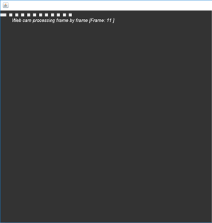
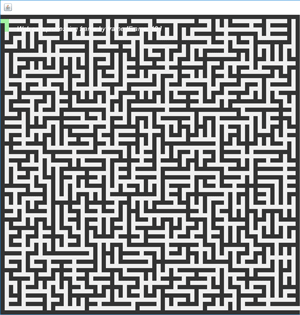
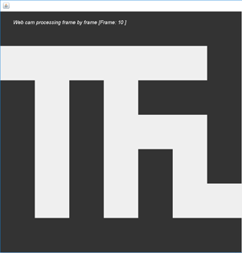
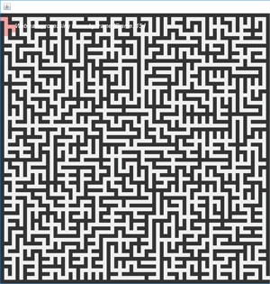
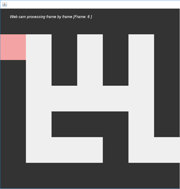
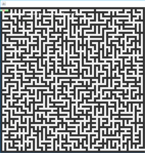
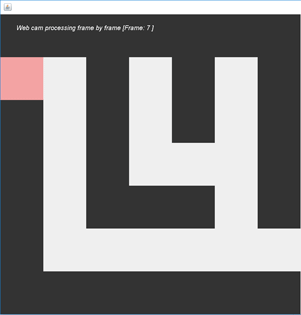

# MazeGenerator

This was a 6-month project for my final year project. 

## Table of Contents

* [What can it do](#what-can-it-do)
* [How to use](#how-to-use)
* [Maze Generation](#Maze-Generation)
  * [Kruskal's Algorithm](#kruskal's-Algorithm)
* [Maze Solving](#Maze-solving)
  * [Depth First Search](#Depth-first-search)
  * [Breadth First Search](#Breadth-first-search)
  * [Wall Follower](#wall-follower)
* [Robot](#robot)
* [Dissertation](#dissertation)

## What does it do

Procedurally generates a random perfect maze of any odd input integer. The procedural generation can be slowed down by millisecond inputted. The maze will then show the solved path with the algorithm chosen, 3 differing algorithms can be chosen from. All algorithms will be run capturing data on time taken, amount of wrong turns, etc. Video integration to allow the maze to be overlaid on top of the video. Solve the maze with an algorithm that can be translated into directions for a human/robot. Input available for robot to solve the maze.


## How to use

```java
VideoCapture video = new VideoCapture(0); // change the integer to 1 if the webcam is plugged in via usb

Number of Rows & Number of Columns: // Enter odd numbers 

WaitTime: // Enter the amount of milliseconds for the application to wait between each change

Camera: // To close the application or generate a new maze deactivate the camera
```

## Maze Generation

After researching many different algorithms for generating a random maze I chose to implement Kruskal’s Algorithm. This algorithm was developed by the mathematician and computer scientist Joseph Kruskal in 1956. The algorithm works by starting off with a set of edges and merging the edges, as long it doesn't create a loop. As shown the in picture below. 

To see further explanations of researching and implementing the algorithm look at Chapter (2.5.2) and (5.4) from my [dissertation](#dissertation).

 

## Maze Solving

3 Algorithms were implemented to solve the maze, these were picked based on time to solve, shortest path found and ease to implementation. For more information see my [dissertation](#dissertation).

* **Depth first search** - The fastest of all algorithms, it shows the shortest path as it is searching and marks wrong turns in red.

 

* **Breadth first search** - Finds the shortest path through a braided maze, traces the shortest path back once it finds the end, but is slow.

 

* **Wall follower** - Is the only implemented algorithm that doesn't find the shortest path a maze. Is a simplistic algorithm that humans can follow easily.

 

## Robot

The finch robot (birdbraintechnologies.com/finch/) was used to solve the virtual maze, a new algorithm was created that the robot could understand.

## Dissertation

[Link to dissertation on GitHub](Dissertation.pdf)

